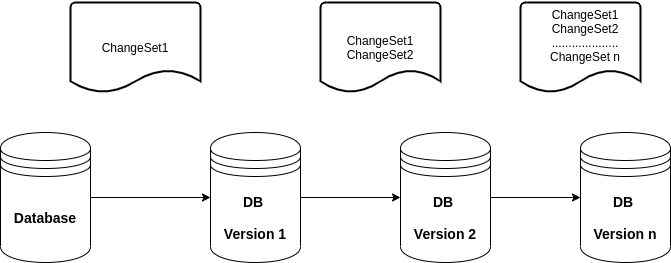
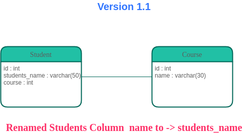
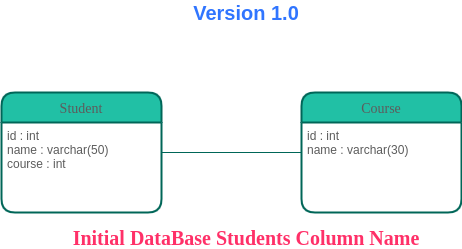

# Introduction

Have you ever accidentally dropped a table or a Column from a production Database and wondered how you would revert the Changes? You can imagine how things can get tough on your side 😃. This can be one of the most scary moments for a Database administrator or even a software developer held up to task with this. If this ever happens,don’t worry, here is where Liquibase comes in with its Rollback support feature.

## What’s Liquibase?

Liquibase is an open-source database schema change management solution that enables you to manage revisions of your database changes easily.

## But How does it work?


Liquibase uses **changeSets** to represent a single change to your database.
**A changeSet** is what you use to group databases together and is a unit of change that Liquibase executes on a database.

**A changeLog** is a list of changes created by multiple changeSets
But how does Liquibase identify a change set?A ChangeSet is identified by 3 elements: **“ID”** and **“author”** and the path of ChangeLog file name.

## Liquibase allows you to perform the following:

**Rollback Support** : You can use liquibase.bat rollback to undo an update, since it allows you to roll back changeSets based on number of changeSets,to a given date, or to a given tag stored in the database.Rollback change for specific versions without needing to know what has already been deployed.

**Automatic updates**: rather than executing updates or rollbacks directly against the database, you can generate the SQL that would be ran for inspection and/or manual execution.

**Future Rollback Output**: Before you apply an update to a database, you can generate the SQL you would need to run in order to bring the database back to the state it is in now for inspection.

**ChangeSet Contexts**: ChangeSets can be assigned “contexts” in which to run. Contexts are selected at runtime and can be used to have changeSets that only run in test instances or other unique circumstances

**ChangeLog and ChangeSet preconditions**: Preconditions can be added to the changeLog or individual changeSets to check the state of the database before attempting to execute them.

**ChangeSet checksums**: When a changeSet is executed, Liquibase stores a checksum and can fail or alter execution if it detects a change between the original definition of a changeSet when it was run and the current definition.

**Difference Support**: Although Liquibase is built to use database comparisons for change management, there is support for it in Liquibase which is helpful in many cases such as performing sanity checks between databases.

You can also use Liquibase with an existing Database, to get started, look up for this [here](https://docs.liquibase.com/commands/community/generatechangelog.html?_ga=2.44491117.836277932.1593518266-987649308.1591097951). Also checkout additional LiquiBase tips from [Baeldung](https://www.baeldung.com/liquibase-refactor-schema-of-java-app).

To set up Liquibase, check the following link from official [documentation](https://www.liquibase.org/get-started/first-steps)

# Diagram Flow of Liquibase Operation.



Liquibase identifies the Database type and different ChangeSets from which it prepares SQL statement from the Database ChangeLogs.

When you run Liquibase for the first time, it creates the DataBaseChangeLog, DataBaseChangeLock for tracking DB changes and execute SQL Queries on Target Databases

When you issue a Liquibase update command, Liquibase will go through Changelog file to see if there are some ChangeSets that have not been updated in the DataBaseChangeLog. If found, it executes them and place the updated record in the table getting you to the latest revision of the structure you are defining.
Rather than writing SQL directly against the database to create, update or drop database objects, desired database changes can be written in different format like in XML,SQL, YAML, JSON.

### ChangeSet Example in a YAML format

```yaml
- changeSet:
    id: 1
    author: josephine
    changes:
      -  addColumn:
          tableName: person
          columns:
            -  column:
                name: username
                type: varchar(10)
``` 

### ChangeSet Examples in XML format

```yaml
- changeSet:
    id: 1
    author: josephine
    changes:
      -  addColumn:
          tableName: person
          columns:
            -  column:
                name: username
                type: varchar(10)
```

### ChangeSet Examples in XML format

```xml
<changeSet  id="1"  author="josephine">   
    <addColumn  tableName="person">          
    <column  name="username"  type="varchar(10)"/>  
    </addColumn>               
</changeSet>
```
Checkout using SQL and JSON formats in this link below

https://docs.liquibase.com/concepts/basic/sql-format.html

# Liquibase Use Case example

In this example am going to showcase how to use Liquibase Rollback feature to undo a Liquibase Database Operation and rollback(revert) to previous database version tag say version 1.0. (Also, Liquibase can roll back without tags).
To run liquibase using maven, you need:

Add `liquibase-maven-plugin in pom file


To run liquibase using Gradle, you need:

Add liquibase-gradle-plugin in build.gradle file,


> To run liquibase in command line download liquibase, unpack its executable file liquibase or    
  liquibase.bat in the package.Download your database jdbc driver to you local disk.

You can choose either command line, gradle plugin or maven plugin to run liquibase, whichever suits you.

## Categories of Liquibase Operations

* **Automatic Rollback** : Database migrations can automatically generate steps required for rolling back. Such change-types includecreate table, rename column, and add column.

* **Manual Rollback** : A rollback command is placed manually because automatic migration instructions cannot be used to identify the statement. Such Change types include drop table and insert data. For these cases you can specify the rollback commands via the tag within the changeset tag. You can use an empty tag if you don’t want anything done to undo a change in rollback mode.

# Samples
For instance the image below represents the current DataBase version say 1.1 , where I renamed the Student column to students_name and now I would wish to revert the changed Column name to the previous 1.0 version where I had labelled it as name.






You can specify the rollback changes in three ways:

### 1. Tag

This entails specifying a tag to rollback to, which will revert all change-sets that were executed against the target database after the given tag was applied. Here is an example using Maven Command:

```bash
mvn liquibase:rollback -Dliquibase.rollbackTag=1.0
```

### 2. Number of Change Sets

You can also rollback by specifying the number of change-sets that needs to rollback.
Here is an example using Maven Command:

```bash
mvn liquibase:rollback -Dliquibase.rollbackCount=1
```

### 3. Date
The date of the roll back can be specified such that the changesets executed after that day will be rolled back.

Here is an example using Maven Command:

```bash
mvn liquibase:rollback "-Dliquibase.rollbackDate=Aug 10, 2020"
```

## Uses of rollback statement in changesets.

There are ways we can use rollback statements in Changesets below are examples:

### i).  Multiple RollBack Tags
It’s possible to have more than one rollback tags in a changeset, However they are executed in the order by which they appear in the changeset:

```xml
<changeSet id=”multipleRollbackTags” author="josephine">
 <createTable tableName=”person">
 <column name=”id” type=”int”/>
 <column name=”username” type=”varchar(30)”/>
 </createTable>
 <createTable tableName=”occupation">
 <column name=”id” type=”int”/>
 <column name=”career_path” type=”varchar(30)”/>
 </createTable>
 <rollback>
 <dropTable tableName=”person">
 </rollback>
 <rollback>
 <dropTable tableName=”occupation">
 </rollback>
</changeSet>
```
### ii). Multistatement RollBack
A single rollback tag may enclose more than one statements to be executed where we drop two tables in the same rollback tag.

```xml
<changeSet id="multiStatementRollback" author="josephine">     
<createTable tableName=”person">
<column name=”id” type=”int”/>
<column name=”username” type=”varchar(30)”/>
</createTable>  
 
 <createTable tableName=”occupation">
 <column name=”id” type=”int”/>
 <column name=”career_path” type=”varchar(30)”/>
 </createTable>
   
<rollback>       
 <dropTable tableName="person"/> 
 <dropTable tableName="occupation"/> 
 </rollback>
</changeSet>
```
### iii). ChangeSet referrals for Rollback

We can refer to another ChangeSet, possibly the original ChangeSet if we are going to change some details in the database. This will reduce the code duplication and can correctly revert the done changes:

```xml
<changeSet id=”referChangeSetForRollback” author="josephine">
 <dropTable tableName=”person"/>
 <dropTable tableName=”occupation"/>
<rollback changeSetId=”multiStatementRollback”   changeSetAuthor="josephine"/>
</changeSet>
```
### iv). Empty RollBack Tag

By default, Liquibase tries to generate a rollback script if we have not provided. If we need to break this feature, we can have empty rollback tag so that rollback operation is not get reverted:

```xml
<changeSet id=”emptyRollback” author=”josephine”>
<createTable tableName=”occupation”>
 <column name=”id” type=”int”/>
 <column name=”career_path” type=”varchar(30)”/>
 <column name=”author” type=”varchar(30)”/>
 </createTable>
 <rollback/>
</changeSet>
```

NB: We can also use the rollbackOneChangeSet command which reverts one non-sequential changeset made during a previous change to your database which is only available for Liquibase Pro users.
Find out much about it from Official LiquiBase Documentation here

https://docs.liquibase.com/commands/pro/rollbackonechangeset.html

Thank you for reading the above Liquibase introduction,

Happy Learning 🙌.
