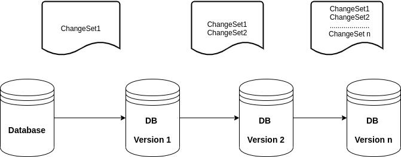

# Introduction

Have you ever accidentally dropped a table or a Column from a production Database and wondered how you would revert the Changes? You can imagine how things can get tough on your side 😃. This can be one of the most scary moments for a Database administrator or even a software developer held up to task with this. If this ever happens,don’t worry, here is where Liquibase comes in with its Rollback support feature.

## What’s Liquibase?

Liquibase is an open-source database schema change management solution that enables you to manage revisions of your database changes easily.

## But How does it work?

Liquibase uses *changeSets* to represent a single change to your database.
*A changeSet* is what you use to group databases together and is a unit of change that Liquibase executes on a database.

*A changeLog* is a list of changes created by multiple changeSets
But how does Liquibase identify a change set?A ChangeSet is identified by 3 elements: *“ID”* and *“author”* and the path of ChangeLog file name.

# Liquibase allows you to perform the following:

*Rollback Support* : You can use liquibase.bat rollback to undo an update, since it allows you to roll back changeSets based on number of changeSets,to a given date, or to a given tag stored in the database.Rollback change for specific versions without needing to know what has already been deployed.

*Automatic updates*: rather than executing updates or rollbacks directly against the database, you can generate the SQL that would be ran for inspection and/or manual execution.

*Future Rollback Output*: Before you apply an update to a database, you can generate the SQL you would need to run in order to bring the database back to the state it is in now for inspection.

*ChangeSet Contexts*: ChangeSets can be assigned “contexts” in which to run. Contexts are selected at runtime and can be used to have changeSets that only run in test instances or other unique circumstances

*ChangeLog and ChangeSet preconditions*: Preconditions can be added to the changeLog or individual changeSets to check the state of the database before attempting to execute them.

*ChangeSet checksums*: When a changeSet is executed, Liquibase stores a checksum and can fail or alter execution if it detects a change between the original definition of a changeSet when it was run and the current definition.

*Difference Support*: Although Liquibase is built to use database comparisons for change management, there is support for it in Liquibase which is helpful in many cases such as performing sanity checks between databases.

You can also use Liquibase with an existing Database, to get started, look up for this [here](https://docs.liquibase.com/commands/community/generatechangelog.html?_ga=2.44491117.836277932.1593518266-987649308.1591097951). Also checkout additional LiquiBase tips from [Baeldung](https://www.baeldung.com/liquibase-refactor-schema-of-java-app).

To set up Liquibase, check the following link from official [documentation](https://www.liquibase.org/get-started/first-steps)

# Diagram Flow of Liquibase Operation.

Liquibase identifies the Database type and different ChangeSets from which it prepares SQL statement from the Database ChangeLogs.

When you run Liquibase for the first time, it creates the DataBaseChangeLog ,DataBaseChangeLock for tracking DB changes and execute SQL Queries on Target Databases

When you issue a Liquibase update command, Liquibase will go through Changelog file to see if there are some ChangeSets that have not been updated in the DataBaseChangeLog. If found, it executes them and place the updated record in the table getting you to the latest revision of the structure you are defining.
Rather than writing SQL directly against the database to create, update or drop database objects, desired database changes can be written in different format like in XML,SQL, YAML, JSON.

