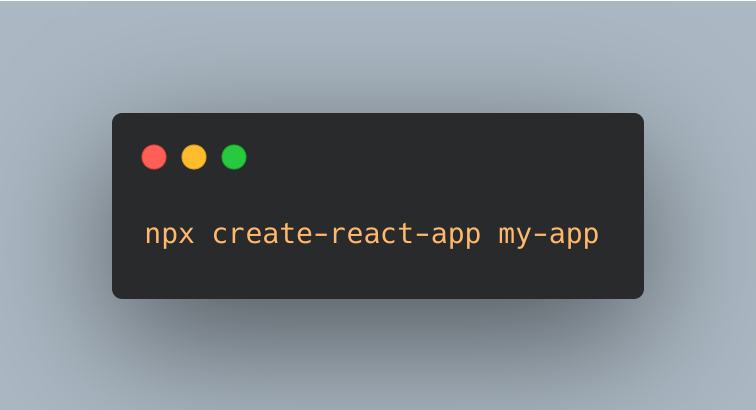
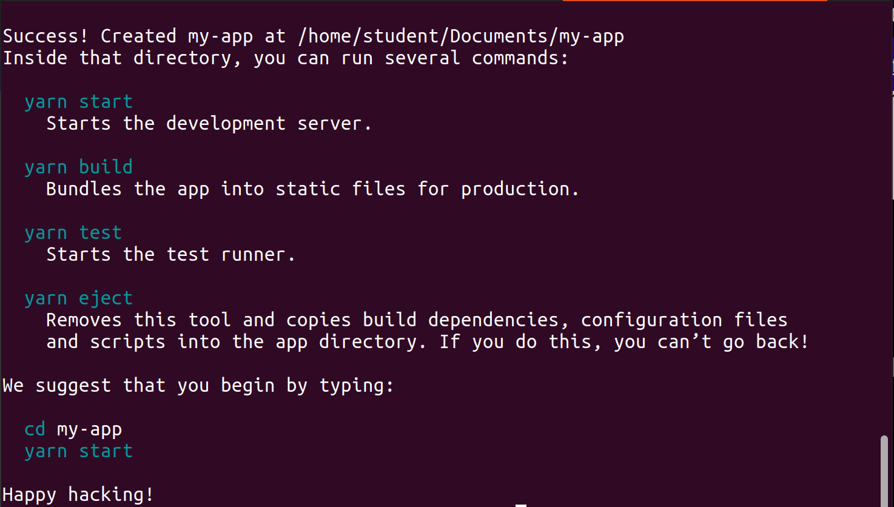
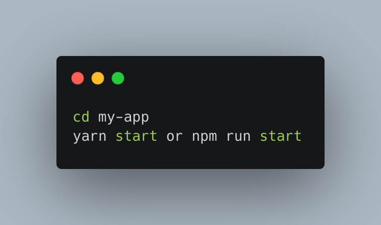
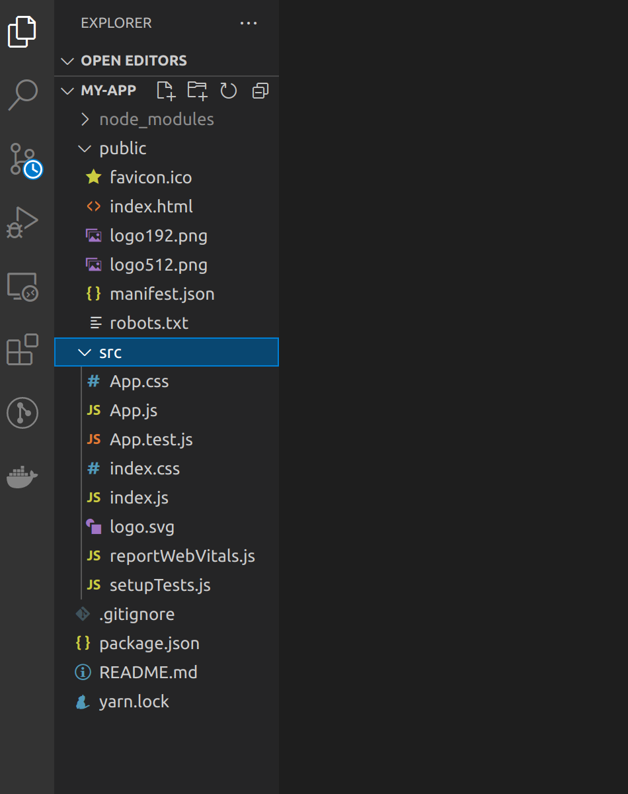
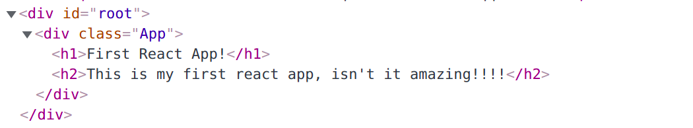

I can almost bet on it that you've fallen in love with JavaScript and want to dive deeper into learning some of it's libaries and frameworks. Well if that's the case then this is the place to be. This guide will walk you through everything you need to know to get started with React.

We'll get set up, explain the how's and why's behind the basic concepts and build a small project that displays data from an API. I am assuming that we have a little knowledge of JavaScript core concepts such as Asychronous programing, Promises, Hoisting, ES6 Syntax etc. If not visit here [<span style="color:blue"> **JavaScript Concepts That Every Developer Must Know** </span>]( https://www.geeksforgeeks.org/7-javascript-concepts-that-every-developer-must-know/) to learn more.

Grab a drink, buckle up and let's get started!

### Sections


[Prerequisites]()
[Basic JavaScript]()
[Basic HTML]()
[Development Environment]()
[Creating a React App]()
[Exploring Create React App]()
[Our First Component]()
[JSX]()
[How a Component Gets Rendered]()
[Let's Display Data Fetched From an API]()


## Prerequisites


You don't need to have any prior knowldge of React before reading this article, you however need to be familiar with a few things in order to get the most out of this guide.

#### Basic JavaScript


React is a JS library so it makes sense to know JavaSript before learning React right? Worry less, you __don't__ need to know Javscript extensively to learn React Js, just the basics.Here's a list of some of the concepts you should be familiar with before learning React.
- Variables, functions and Data Types
- Asychronous Programming
- Arrays and Objects
- ES6 features and syntax
- DOM Manupulation

#### Basic HTML

In React we use JSX, which we will dive into later. But for now have a good grasp of HTML preferably HTML5.

- How to structure HTML elements.
- HTML attributes such as class, id, onclick, href etc

## Development Environment

The first thing we do before interacting with any programming language is to set up it's developemt environment, React JS is no different.
If you have **Node JS** and **Visual Studio Code** (or your preffered IDE) set up you can skip this section.

#### Node JS

Do I really need node to set up a React app? The answer is no. If you are a web developer that can handle HTML/CSS and JavaSCript you can try React without Node JS or any other complext tool to manage it. That's your assignment.

In our case we need Node js. To download it visit [<span style="color:blue">**this link**</span>]( https://nodejs.org/en/download/ ) and choose one that fit's your machine.

When the installation is complete, open your terminal and type 
 > node -v 

This should show you the version of node that you have installed.
The output should look something like:
 > v16.7.0

Hurrraaaaaayy!!! Congratulations! You have completed the first step to getting started with React.


#### Visual Studio Code

VSC is a popular Open Source IDE for frontend development. There's a bunch of IDEs that you can try depending on your preference. For now we will run with Visual Studio Code.

Click [<span style="color:blue">**this link**</span>]( https://code.visualstudio.com/download ) to download the version that suits your platform.
That's enough development set up for now.


## Creating a React App

The next step is now creating a React app. Thank God for the folks at Facebook who made it easy for us to do that.
All we to do is run this command in our terminal.

 <!-- > npx create-react-app my-app -->

 

This creates a React project called my-app.


Realize we've been directed on how to start our app



 Run these commands on your terminal, this will start a development server and open a web browser for you.
 

 You;ve just set up your first React app, if you want to know more about what happens in the background visit this link [Create React App](https://github.com/facebook/create-react-app)


## Exploring Create React App



After running  ``npx create-react-app yourApp``, you will find your app root has three folders, ``node_modules/``, ``public/``, ``src/`` and three files ``.gitignore``, ``package.json``, ``README.md`` and ``yarn.lock``.

### Running create-react-app

Let's break down what you just did. The first line in the output is from ``npx`` . There are two things `npx` can do when you give it the command. It first looks in your local machine for the package to run it. If it doesn't find one, it starts looking for ``npm``'s package list. The first message in the output is just letting you know that it handled getting it.

Next inside ``create-react-app``, your command runs through a series of checks. It finds information about your system, looks for any flags attached and whether you specified a folder to output. Then the actual ``createApp`` function runs. This checks if the directory you choose is a safe one. It does this by looking for log files, if it fails any of this checks you will receive an error message.

Next it begins to form a ``package.json`` file with the default values ``name: yourAppName``, ``version: 0.1.0`` and ``private: true``. This is written to the directory you specified. Here it determines if it should use ``yarn`` or ``npm`` based on what you have in your machine. A series of checks are run on the version of ``npm/yarn``, ``node version`` to select the correct version of ``react-scripts`` to use.

The next function is called ``run()`` . This continues the installation. Right now the only output you've seen so far is is the npx line  "Creating a react app in <YourDirectory>". The dependency list is created. By default this icludes ``react``, ``react-dom`` and the version of ``react-scripts`` either from the internet if you are online or the local cache if you are not.

This is where you get the line ``installing react, react-dom and react scripts``. The first thing it does is check if there's ``package.json`` file and ``yarn.lock``. It loads ``package.json`` file into a variable called ``appPackage`` in JSON format. It checks if TypeScript is a dependency after it does this. Next it begins adding to the JSON.

First is the scripts, this will probably be familiar as ``start``, ``build``, ``eject`` and ``test``. These are located in init.js file that we are currently going through. Next is the eslintConfig and defaultBrowsers. These are by default `>0.2%','not dead', 'not ie <= 11','not op_mini all'. Basically this means target all browsers that are higher than .2% market share, in active use, not below IE 11 or Opera Mini.This is a seperate package located in ``package.json``. You can find it  [<span> Here </span>](https://www.npmjs.com/package/browserslist).

The ``package.json`` file is written out and will not be changed again. At this point there's no output yet, a ``README.md`` file is checked and if it exists it is renamed. The files specified in the template folder are then copied to a working directory. This is the ``public``, ``README.me``, ``src`` and ``gitignore``. ``gitignore`` is copied without the ``.`` infront then renamed, this is to prevent an npm bug.

After a check to see if React is installed, it moves to check if the repository has been initialized with git. These runs git init, and adds the first commit. This is where the line ``Initialized a git repository`` comes from.

The last thing init.js does before ending the process is print the success message and instructions. These introduce you to basic ``react scripts`` commands and suggest you cd into your app directory to run your application.


### Index.html

This is the entry file, the first thing that the web browser loads when a user navigates to your app. If you look at the file, it's just a normal HTML file that you're hopefully familiar with. If you look at the body, it's empty. React dynamically convert our React code into HTML and load it here, in the div with id "root". With that out of the way let's get to the juicy part.


## Our First Component
Open up our **App.js** component, this is the main component in our application. It is the first component to be rendered, the icing to our cake.

The first thing we are going to do with our icing is remove all the code so that we build our component from scratch so that we better understand what's going on. 

Now that we have a nice and clean slate,we will start by importing ``react``

``import react from 'react';``

Next we declare a function, we will use ES6 arrow function here. That's more or less what a component is...A function with some logic and markup ( In this case JSX ). We are also going to export this function so we can use it elsewhere.

        ```js
         const App = () =>{

                }

            export default App;
        ```

Within this code we write a ``return()`` statement, that is what get's returned from this component, and contains our markup that get's rendered inform of HTMl.
Finally let's add a ``div``  with an ``h1`` title tag. Our finished component looks like this:

        ```js
        const App = () =>{
            return(
                <div>
                <h1>Our First React App</h1>
                <h2>This is our first react app, isn't it amazing!!!!</h2>
                </div>
            )
        }
        ```

Now you are probably thinking, Whoah!! HTML in a function? Even though it looks like HTML, it's something called JSX( JavaScript XML ).It allows us to mix JavaScript and HTML.
This might seem a littel peculiar cause we started learning front-end development by seperating HTML and JavaScript( and even CSS ). That is where libaries come in, to keep things together and to make writing code easier.Keeping everything together in the same component makes it easier to maintain and reuse the code.

Let's see that in action. Run this command in your terminal

``npm run start``

This should open the browser and you should be able to see your application running.

Voila!! You just created your first component.


### JSX

Let's dive deeper into JSX, you probably have some questions lingering.

            ```js 
            return(
                <div>
                    <h1>Our First React App</h1>
                    <h2>This is our first react app, isn't it amazing!!!!</h2>
                </div>
                );
            ```

This looks like HTML and it's not. It's JSX! Evn though it looks like normal HTML but it's not, React is creating the element tree using the following syntax:
    ``React.createElement(component,props,...children)``

- component: The HTML element you wish to create i.e ``div``, ``h1``
- props: Any props you wish to pass to the component
- children: An array of **HTML Elements** nested within a component.

So the same component we just created can be written as:

       ```js
        const App = ()=>{
            return(
                React.createElement('div', null, React.createElement('h1',null, "Hello World"),
                
                React.createElement('div', null, React.createElement('h1',null, "This is our first react app, isn't it amazing!!!!"))
            );
         }
      ```

This is a whole lot to type right? It looks messy. If you trace through it you will realize we are creating a `div` which has no props passed to it and has other elements created inside it which are `h1` and `h2`. If you've interacted with JavaScript a lot you'll realize that it a lot similar to ``document.createElement`` after all this is a JavaScript library.

This is the beauty of JSX, it allows you to write JavaScript and HTML without going through the hustle of ``React.createElement()``.
React developers almost exclusively use JSX, this section was important to understand what happens under the hood.


### Making things dynamic

Why use JSX when you can just write HTML and get away with it? Well if we remember what JSX stands for( JavaScript XML ). This means we can use JavaScript to make things dynamic. Our previous example looks like so:

     ```js 
     const App = () =>{
            return(
                <div>
                <h1>Our First React App</h1>
                <h2>This is our first react app, isn't it amazing!!!!</h2>
                </div>
            )
        }
    ```
     

Now let's make it dynamic.
Create a variable ``message`` to hold our message.

``const message = 'This is our first react app, isn't it amazing!!!!';``

Now to add JavaScript to use this, we use **curlybraces** `{}`.

        ```js 
        const App = ()=>{
            const message = 'This is our first react app, isn't it amazing!!!!';
            return(
                <h1>Our First React App</h1>
                <h2>{ message }</h2>
            )
        }
        ```

If you run this in your terminal you will see the output. Now go ahead and change the message and see magic!

We use curly braces to tell the compiler **"execute this code in JavaScript"**. If we didn't have the curly braces the message wouldn't be executed as JavaScript, and instead the text 'message' would be displayed on your browser.

## How a component gets rendered.

Hopefully, I have cleared all the questions you have about JSX and creating components plus making them dynamic. I know you still asking yourself how these components get rendered right? This section will clear that up.
Let's take a look at our file structure, notice ``index.html`` , this is always considered an entry file, to most developers if not all. You can change the entry point if you wish. For now we will leave it as is.

Focus on this line of code
  ```js
  ReactDOM.render(<App />, document.getElementById("root"));
  ```

Notice we have ``document.getElementById("root");`` finally some normal looking JavaScript. This gets the root element from the DOM using plain JavaScript and renders our App component within it. Our App component is imported like so:

``import App from './App';``

Remember we exported App from our App component. This lets other files or components use App component.

The ``root`` element comes from *index.html* file from our folder called ``public/`` . As mentioned earlier, ``index.html`` is the file that gets rendered when the application loads. Within it we have a ``div`` with an id ``root`` which is empty and where our React components get rendered. Let's open our dev tools and have a look.




## Let's display data fetched from an API

Wuuuuh wuuuh!! This is the most interesting part, in JavaScript there'll always be data to be fetched and dislplayed because you constantly have to communicate with the backend. We will not dive in too deep. We will use ``fetch API``. Fetch API uses ``Promise`` to deliver more flexible features to make requests to servers from web browsers. In addition it is much simpler and cleaner compared to ``XMLHttpRequests``.

The ``fetch()`` is available in global scope which instructs the web browsers to make requests.

### Sending a request

The ``fetch()`` only requires one parameter which is the url for the resources you want to fetch.
        let response = fetch(url);

The ``fetch()`` returns a ``Promise`` so you can use ``then`` and ``catch`` to handle it.

        ```js 
        fetch(url)
        .then(response => {
        //Handle response
        })
        .catch(error =>{
         //Handle error
        });
        ```

When the response completes the response is available. At this time, the Promise will resolve into ``Response`` object.

The ``Response`` object is the API wrapper for the fetched url resources. The ``Response`` object has a number of useful properties and methods to inspect the response.

Let's get right into the juice.
Visit this [<span> link </span>](https://catfact.ninja/fact)to get some free APIs. Choose any that you please. In our case we will use ``Cat facts APIs``. I love cats!!

        ```js 
        import "./App.css";
        import React from "react";

        const App = () => {
        let catFact = {};
        let fact = '';
        const fetchAPI = () => {
            fetch("https://catfact.ninja/fact")
            .then((response) => {
                return response.json();
            })
            .then(data =>{
            catFact = data;
            fact = catFact.fact;
            console.log( catFact );
            console.log(fact);
            })
            .catch((err) => console.log(err))
        };

        fetchAPI();

        return (
            <div className="App">
            <h1>First React App!</h1>
            </div>
        );
        };

        export default App;
        ```

To your previous code, add the above snippet and open your console to view your data. Now as an assignment work on displaying the data on your browser.

There are better libararies used to fetch APIs such as ``axios``.[<span>Here's a link to a comprehensive view of axios</span>](https://github.com/axios/axios)


Happy coding!!!!


